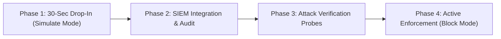

# Spryzen Enterprise Evaluation & Proof-of-Value (PoV) Guide

> **Target Audience:** CISOs, Security Engineers, DevOps Leads, and Enterprise Architects evaluating Spryzen in staging or production.

---

## 1. Executive Summary

Spryzen is an enterprise-grade, memory-safe (Rust) Web Application Firewall and Zero-Trust Reverse Proxy engineered for sub-millisecond inspection latency and high-throughput environments (>19,000 RPS).

This guide provides a structured **4-Phase Evaluation Sequence** enabling security teams to test and evaluate Spryzen against live or staging traffic with **zero risk of downtime or false-positive disruption**.

---

## 2. The 4-Phase Evaluation Sequence



### Phase 1: 30-Second Drop-In (Simulate Mode — Zero Downtime Risk)

In **Simulate Mode**, Spryzen inspects 100% of incoming HTTP/HTTPS traffic, evaluates payloads against SIMD AVX2 pattern rules, attaches audit headers, and streams structured logs to your SIEM. **It will never block, alter, or drop clean or suspicious requests.**

```bash
docker run -d \
  --name spryzen-eval \
  -p 80:8080 \
  -e UPSTREAM_URL="http://your-staging-backend:8080" \
  -e SPRYZEN_MODE="simulate" \
  -e RATE_LIMIT_RPS="10000" \
  ghcr.io/aditya-9-6/spryzen:latest
```

*Or via Kubernetes Helm:*
```bash
helm upgrade --install spryzen ./charts/spryzen \
  --set spryzen.upstreamUrl="http://my-service:8080" \
  --set spryzen.mode="simulate"
```

---

### Phase 2: SIEM Integration & Telemetry Verification

Spryzen emits line-delimited NDJSON events with automated masking of sensitive authorization credentials (`authorization`, `cookie`, `x-api-key`).

#### Sample SIEM Audit Log (`stdout` / Docker log stream)
```json
{
  "timestamp": "2026-10-04T12:00:00.123456Z",
  "client_ip": "203.0.113.195",
  "method": "POST",
  "path": "/api/v1/search",
  "status": 200,
  "verdict": "WOULD_BLOCK",
  "threat": "SQL_INJECTION",
  "mode": "simulate",
  "duration_micros": 18
}
```

In your downstream backend application or browser developer tools, observe the response headers appended by Spryzen:
- `x-spryzen-mode: SIMULATE`
- `x-spryzen-simulated-verdict: WOULD_BLOCK`
- `x-spryzen-threat: SQL_INJECTION`

---

### Phase 3: Synthetic Attack Verification Matrix

Run the following test probes against your Spryzen evaluation gateway to verify detection accuracy:

| Attack Category | Test Probe (Harmless Curl Command) | Expected Response (Simulate Mode) | Expected Response (Block Mode) |
| :--- | :--- | :--- | :--- |
| **Clean Baseline** | `curl -i http://localhost/api/users?page=1` | `200 OK` (`x-spryzen-verdict: ALLOW`) | `200 OK` (`x-spryzen-verdict: ALLOW`) |
| **SQL Injection** | `curl -i "http://localhost/api/search?q=1%27+OR+%271%27=%271"` | `200 OK` (`x-spryzen-simulated-verdict: WOULD_BLOCK`) | `403 Forbidden` (`{"error":"Blocked by Spryzen"}`) |
| **Cross-Site Scripting (XSS)** | `curl -i "http://localhost/api/comment?b=%3Cscript%3Ealert(1)%3C/script%3E"` | `200 OK` (`x-spryzen-simulated-verdict: WOULD_BLOCK`) | `403 Forbidden` (`{"error":"Blocked by Spryzen"}`) |
| **Path Traversal** | `curl -i "http://localhost/static/../../../../etc/passwd"` | `200 OK` (`x-spryzen-simulated-verdict: WOULD_BLOCK`) | `403 Forbidden` (`{"error":"Blocked by Spryzen"}`) |
| **Remote Code Execution (RCE)** | `curl -i "http://localhost/exec?cmd=;+cat+/etc/passwd"` | `200 OK` (`x-spryzen-simulated-verdict: WOULD_BLOCK`) | `403 Forbidden` (`{"error":"Blocked by Spryzen"}`) |
| **SSRF Probe** | `curl -i "http://localhost/fetch?url=http://169.254.169.254/latest/meta-data/"` | `200 OK` (`x-spryzen-simulated-verdict: WOULD_BLOCK`) | `403 Forbidden` (`{"error":"Blocked by Spryzen"}`) |
| **Rate Limit Burst** | Send requests exceeding configured RPS | `429 Too Many Requests` (`Retry-After: 1`) | `429 Too Many Requests` (`Retry-After: 1`) |

---

### Phase 4: Production Blocking Promotion

Once the security team has audited the SIEM logs over 24-48 hours with 0.00% false positives, flip the enforcement mode to `block`:

```bash
docker run -d \
  --name spryzen \
  -p 80:8080 \
  -e UPSTREAM_URL="http://your-backend:8080" \
  -e SPRYZEN_MODE="block" \
  ghcr.io/aditya-9-6/spryzen:latest
```

All malicious payloads are instantly terminated at the edge with HTTP `403 Forbidden` within 20 microseconds, shielding the upstream backend from application load.

---

## 3. Prometheus Observability & Dashboards

Spryzen provides an integrated Prometheus scraper endpoint:
```bash
curl http://localhost:8080/metrics
```

Key exposed metrics:
- `spryzen_requests_total`: Total HTTP requests processed
- `spryzen_threats_blocked_total`: Total malicious attacks blocked or simulated
- `spryzen_clean_requests_total`: Total clean requests forwarded
- `spryzen_rate_limited_total`: Total requests throttled by token bucket
- `spryzen_p50_latency_nanoseconds` & `spryzen_p99_latency_nanoseconds`: Inspection latency histograms

---

## 4. Support & Technical Assistance

For enterprise deployment architecture reviews, custom CRS rulesets, or private air-gapped on-premises builds:
- **Email:** `aditya@spryzen.io`
- **GitHub Discussions & Issues:** [https://github.com/Aditya-9-6/spryzen](https://github.com/Aditya-9-6/spryzen)
